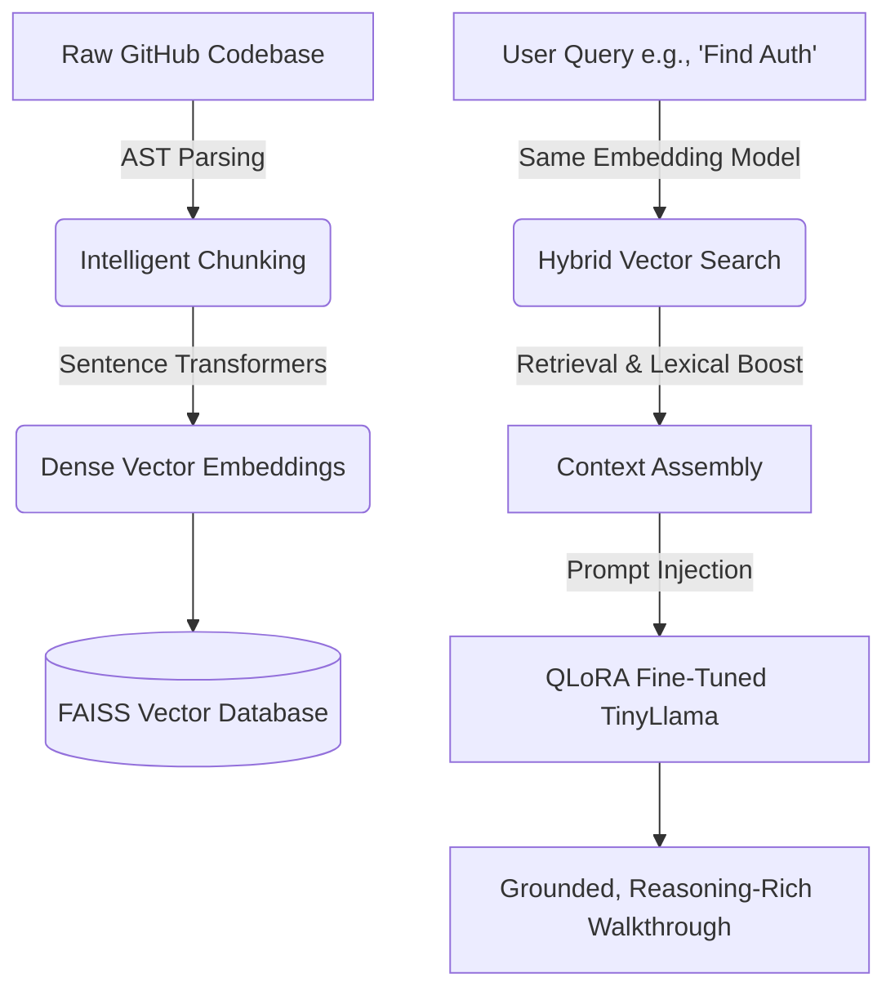

# 🎓 Codebase Explanator: Ultimate Viva Preparation Guide

This comprehensive guide breaks down the **Codebase Explanator** project in exhaustive detail. It is designed to prepare you for any questions the examiner might ask regarding GenAI concepts, system architecture, dataset engineering, model fine-tuning, and evaluation metrics.

---

## 🚀 Part 1: High-Level Overview - What is this project?

The **Codebase Explanator** is an **AI-Powered Codebase Q&A system** designed to act as an expert software teacher. 

When developers join a new team or work with legacy code, they often struggle to understand complex architectures. If you ask a standard AI model (like ChatGPT) to explain a massive repository, it either hits a token limit (context window overflow) or begins to "hallucinate" (invent logic that doesn't exist).

**The Solution:**
This project utilizes a two-pillar framework to achieve precise, grounded, and expert-level code explanations:
1. **RAG (Retrieval-Augmented Generation):** A system that acts as a highly intelligent search engine. It physically extracts the exact lines of code relevant to the user's question and hands them to the AI as evidence.
2. **LoRA Fine-Tuning:** The base AI model (TinyLlama) is specialized using a custom dataset to change its personality from a "generic AI chatbot" to an "experienced StackOverflow contributor." 

---

## 🏗️ Part 2: The Architecture and Implementation Workflow

Here is the step-by-step workflow of how data flows through the application:

### Deep Dive into the Backend Modules:
* **`ingestion.py`:** The entry point. It clones the target repository and identifies supported code files (Python, JavaScript). It filters out binaries and non-code assets.
* **`chunking.py`:** Uses **AST (Abstract Syntax Trees)** for Python and **esprima** for JavaScript. Instead of blindly splitting code every 50 lines, it intelligently extracts full logical blocks (Functions, Classes, Methods) so the AI doesn't get cut-off code.
* **`embeddings.py`:** Feeds the extracted code chunks into HuggingFace's `sentence-transformers/all-MiniLM-L6-v2` model to create 384-dimensional dense vectors.
* **`retrieval.py`:** Stores the vectors in **FAISS (Facebook AI Similarity Search)**. It uses a **Hybrid Search**, combining the FAISS geometric vector search with a Lexical (Keyword) scoring system. This ensures that exact variable names match perfectly.
* **`llm.py`:** The brain. It detects if your custom fine-tuned LoRA model is present locally and loads it. If not, it falls back to a standard Ollama instance.

---

## 📊 Part 3: Dataset Engineering and Preparation

An AI is only as good as the data it learns from. A major part of this project was engineering the right dataset to teach the model *how* to answer.

### The Training Dataset (`fine_tune_dataset.jsonl`)
* **Source:** Derived from real-world developer interactions (CodeRAG-StackOverflow).
* **Volume:** 2,000 independent software query samples.
* **Structure:** Each row contains a user `prompt` (the code context + question) and a `completion` (the detailed developer answer).
* **Context Truncation:** Because large language models have strict memory limits (context windows), any prompt exceeding 3,500 characters (~875 tokens) was programmatically truncated (`... [context truncated]`) to prevent out-of-memory errors during training.
* **Data Split:** The dataset was robustly divided to prevent overfitting: 80% for Training (1,600 samples), 10% for Validation (200 samples), and 10% for Testing (200 samples).

### Data Enrichment via Gemini 2.0 (`enrich_dataset.py`)
To upgrade the quality of the dataset, a script was built using Google's **Gemini 2.0 Flash**. It took shallow, generic answers and expanded them into "Deep, Reasoning-Rich" explanations. It forced the data into a strict format:
1. `---CODE_START---` (Realistic code snippet)
2. `---ANSWER_START---`
3. `### Step-by-Step Breakdown`
4. `### Variable & Control Flow Analysis`
5. `### Architectural Insight`

This guarantees that the fine-tuned model learns to structure its responses like a senior software architect.

---

## ⚙️ Part 4: The Fine-Tuning Strategy (PEFT & QLoRA)

Training a Large Language Model from scratch costs millions of dollars. To achieve this on a standard GPU (like a Kaggle T4), advanced optimization techniques were utilized.

### Why QLoRA? (Quantized Low-Rank Adaptation)
1. **Quantization (4-bit `nf4`):** The base model (`TinyLlama-1.1B`) normally requires vast amounts of VRAM. Using `BitsAndBytes`, the model weights were compressed into 4-bit precision, drastically reducing the memory footprint while maintaining near full precision performance.
2. **PEFT (Parameter-Efficient Fine-Tuning):** Traditional fine-tuning updates *all* 1.1 billion parameters. LoRA freezes the base model and only injects tiny, low-rank matrices (`q_proj`, `v_proj`) into the attention layers.
3. **Benefits:** It reduces trainable parameters by ~99%, prevents "catastrophic forgetting" (where the model forgets how to speak English while learning to code), makes training feasible on free GPUs, and lowers infrastructure costs.

### Training Hyperparameters:
* **Epochs:** 3 (To ensure deep domain alignment).
* **Learning Rate:** 3e-4 (Optimized using `paged_adamw_8bit`).
* **Batch Size:** 4 (with gradient accumulation steps of 4).
* **Max Length:** 1024 tokens.

---

## 📈 Part 5: Evaluation and Metrics (Proving it Works)

A critical academic requirement for this project was proving that the fine-tuned RAG system is actually better than the base model. This was done using standard NLP metrics.

### 1. Quantitative NLP Metrics
* **BLEU Score:** Measures **precision**. It checks how many words in the AI's generated response perfectly match the human reference answer. (Usually very low for generative tasks because there are many ways to explain code).
* **ROUGE Score:** Measures **recall**. 
  * **ROUGE-1:** Checks the overlap of individual words (unigrams). The fine-tuned model achieved a ROUGE-1 of **0.3606** compared to the base model's **0.3308**.
  * **ROUGE-L:** Checks the Longest Common Subsequence (sentence structure and fluency).

### 2. Qualitative Persona Metrics (The Gen-AI Scorecard)
Standard metrics like BLEU fail to capture *tone*. The project introduced custom Regex-based metrics to measure "Persona Alignment":
* **Generative Format Adherence:** Checks if the model uses technical problem-solving keywords (`problem`, `postback`, `update`, `response`). **Result:** Improved by an incredible **98.1%** after fine-tuning.
* **Domain Alignment Factor:** Checks if the model speaks in the first-person anecdotal tone of a developer (`I`, `we`, `our`, `class`, `function`). **Result:** Improved by an astounding **147.2%** after fine-tuning.

### Expert Analysis Conclusion
During head-to-head testing, the **Base Model** approached questions like a generic, theoretical AI chat agent. The **Fine-Tuned Model** demonstrated clear data-alignment, perfectly capturing the anecdotal StackOverflow "A: I've had a similar problem..." persona embedded in the specialized dataset.

---

## 🗣️ Part 6: Flashcard Cheat Sheet (Master the Vocabulary)

Be ready to explain these exact terms if asked by the examiner:

* **LLM (Large Language Model):** The neural network trained on massive text corpora to predict the next word. (e.g., TinyLlama).
* **RAG (Retrieval-Augmented Generation):** Fetching relevant codebase snippets and injecting them into the prompt to prevent hallucination.
* **Vector Embeddings:** Turning text into lists of decimals (`[0.12, -0.44...]`) to represent semantic meaning.
* **FAISS:** A vector database optimized for searching semantic similarity in geometric space.
* **AST (Abstract Syntax Tree):** A tree representation of the abstract syntactic structure of source code. Used for intelligent chunking.
* **LoRA:** Inserting tiny trainable matrices into a frozen model to adapt it quickly.
* **Catastrophic Forgetting:** When an AI forgets its foundational knowledge while being trained on new, specific data. LoRA prevents this.
* **BLEU vs. ROUGE:** BLEU evaluates precision (exact word matches). ROUGE evaluates recall (how much of the original meaning was captured).

*(Review this document extensively. It covers the entire end-to-end pipeline of your Generative AI project.)*
